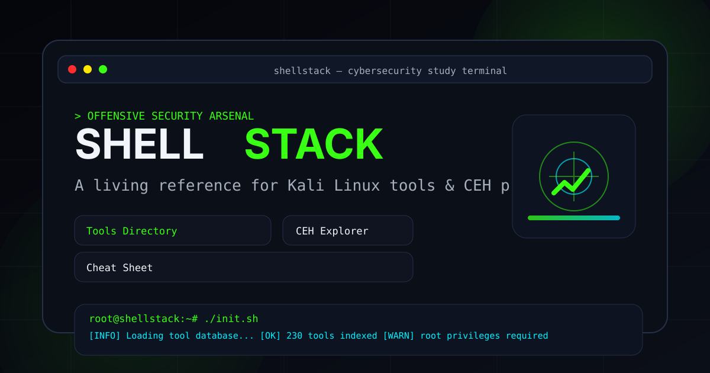

# <div align="center">SHELLSTACK</div>

<div align="center">

### Cybersecurity learning, tool exploration, command building, and real Kali Docker execution in one workspace

[Live Demo](https://shell-stack.vercel.app/) | [Vite](https://vitejs.dev/) | [React 19](https://react.dev/) | [TypeScript](https://www.typescriptlang.org/)

</div>

---



## Overview

ShellStack is a visually immersive, high-performance cybersecurity study platform built for ethical hackers, students, and security researchers who want more than static notes.

It combines:

- **Dual-Engine Terminal**: Switch seamlessly between a zero-install **Simulated Browser Shell** and a **Real Kali Docker Engine** (`ws://localhost:7681`).
- **Curated Tool Directory**: Browse 280+ offensive security tools categorized across 19 domains with ranked search and category filters.
- **Deep Tool Intelligence Modals**: Deep detail views with commands, flags, examples, installation notes, legal warnings, and tactical walkthroughs.
- **Interactive Command Builders**: Parameterized form controls that generate customized security commands in real time.
- **Cross-Route Command Dispatch**: 1-click **Run** buttons everywhere that dispatch commands directly into your terminal with zero loading delays.
- **CEH Study Explorer**: 20 structured CEH v12 learning modules covering the full ethical hacking curriculum.
- **Command Cheat Sheet Console**: Large searchable reference catalog for instant command recall and 1-click clipboard copies.
- **Interactive Guided Missions**: Terminal-based challenges validating command execution against learning objectives.

The result is a single environment for learning concepts, exploring tools, and quickly turning knowledge into usable command workflows.

---

## Why It Hits Different

| System | What it gives you |
| --- | --- |
| `Dual Terminal Engines` | Choose between instant in-browser simulation or real local Kali Linux execution via Docker (`ws://localhost:7681`). |
| `Tool Directory` | Browse a large offensive security catalog with ranked search, category filtering, command previews, and drill-down detail views. |
| `Tool Detail Modal` | Explore commands, common flags, usage context, installation notes, examples, legal warnings, and tactical guides without leaving the page. |
| `Interactive Command Builder` | Generate parameterized commands live from form inputs and execute or copy them instantly. |
| `CEH Module Explorer` | Navigate 20 CEH-focused learning modules through a dense, visual study interface. |
| `Cheat Sheet Console` | Search across a large command reference and copy or run high-value commands quickly. |
| `Terminal Experience` | Learn in an interface designed to feel like a cyber operations console rather than a generic docs page. |

---

## Product Coverage

```text
19 Tool Categories
20 CEH Modules
280+ Curated Security Tools
1000+ Command Entries
800+ Flag References
6 Core Route Experiences
Dual Terminal Execution Engines
```

---

## Architecture & Terminal Engines

ShellStack features a dual-engine architecture to suit both instant learning and real-world execution:

| Terminal Engine | Description & Tech | Best For |
| --- | --- | --- |
| **Simulated Browser Engine** | Built-in JavaScript terminal simulation featuring a mock Kali filesystem (`/home/kali`, `/usr/bin`), simulated command outputs (`nmap`, `sqlmap`, `neofetch`, etc.), and interactive guided missions. | Zero-setup browser learning, quick testing, and mission challenges. |
| **Real Kali Docker Engine** | Connects to a local Docker container or Node bridge running `ttyd` via WebSocket on `ws://localhost:7681`. Runs **real offensive security commands** 100% locally on your machine. | Actual penetration testing, real package installation (`apt install`), and native Linux execution. |

---

## 1-Click Real Docker Setup

To connect ShellStack to your local Kali Linux Docker environment:

```bash
docker rm -f shellstack-kali; docker run -d --name shellstack-kali -p 7681:7681 --restart unless-stopped kalilinux/kali-rolling sh -c "apt-get update && apt-get install -y ttyd && ttyd -p 7681 -W bash"
```

> **Note**: Uses the official `kalilinux/kali-rolling` image from Offensive Security. The `-W` flag enables full interactive terminal typing and WebSocket streaming.

---

## Main Experiences

### `/`
The landing experience combines the cinematic hero, Kali/Linux foundation overview, and featured tool discovery into a strong first pass through the platform.

### `/tools`
The full offensive security directory with ranked search, category filtering, command previews, tactical application hints, and full tool documentation modals.

### `/ceh`
A CEH-oriented module explorer built to support structured study instead of flat reading across 20 core topics.

### `/terminal`
A live dual-engine terminal section for command execution, telemetry monitoring, and mission challenges.

### `/study`
A study-oriented route that connects learners to practical resources, tool kits, and guided learning paths.

### `/cheatsheet`
A dense command-first reference experience with searchable categories, operator-style navigation, and one-click copy and run actions.

---

## Feature Highlights

### Cross-Route Command Dispatch
Clicking **Run** on any tool card, modal, interactive builder, or cheat sheet dispatches the command across routes seamlessly into the active terminal engine with a persistent **Command Ready** banner.

### Dynamic Command Builders
Some tools include interactive builders that turn user input into ready-to-run commands in real time.
- text, select, and checkbox-driven parameters
- generated output preview
- 1-click **Run in Terminal** and clipboard workflow
- built directly into tool documentation

### Deep Tool Documentation
Each tool surfaces comprehensive operational details:
- essential commands
- common flags
- when-to-use guidance
- related tools
- installation notes
- sample output
- practical examples
- tactical walkthroughs for richer tools

### Search Designed for Discovery
Tool search ranks results to make exact, prefix, and high-signal matches easier to find fast.

### Visual System with Purpose
ShellStack leans hard into a cyber-ops identity:
- terminal surfaces
- neon accents
- scanline and HUD-inspired atmosphere
- dense but organized information design
- motion used for orientation, not noise

---

## Built With

- **Core Framework**: React 19, TypeScript, Vite
- **Styling & UI**: Tailwind CSS, Vanilla CSS Tokens, Lucide Icons, React Icons
- **Animation & Motion**: GSAP, ScrollTrigger
- **Routing & State**: React Router DOM v7, Custom Reactive Event Store (`terminalStore`)
- **Terminal Integration**: WebSocket Client, `ttyd` Web Terminal Server Bridge

---

## Project Shape

```text
app/
├── public/
├── src/
│   ├── components/       # Modals (ToolDetail, DockerConnect, CommandBuilder, etc.)
│   ├── data/             # Tool catalog, CEH modules, cheat sheets, terminal simulations
│   │   ├── modules/
│   │   └── tools/
│   ├── hooks/            # useRunInTerminal, useTerminalStore hooks
│   ├── lib/              # terminalStore singleton & WebSocket state management
│   ├── pages/            # CheatSheetPage, etc.
│   ├── sections/         # LiveTerminal, Hero, ToolsDirectory, CEHExplorer, etc.
│   ├── App.tsx           # Main router & layout shell
│   └── index.css         # Cyber-ops styling design system & custom utilities
├── package.json
└── vite.config.ts
```

---

## Philosophy

ShellStack is designed around a simple idea:

> *learning security tools should feel operational, not passive*

The UI, information density, and route structure are all built to support that feeling.

---

## Responsible Use

This project is intended for authorized cybersecurity learning, lab work, and ethical security education only.

Only use security tools and commands in environments you own or are explicitly permitted to test.

---

## Live Production Site

🌐 **Production Application**: [https://shell-stack.vercel.app/](https://shell-stack.vercel.app/)

---

<div align="center">

### Learn the system. Command the toolkit.

</div>
